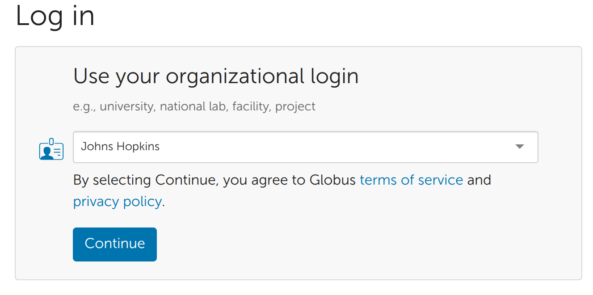
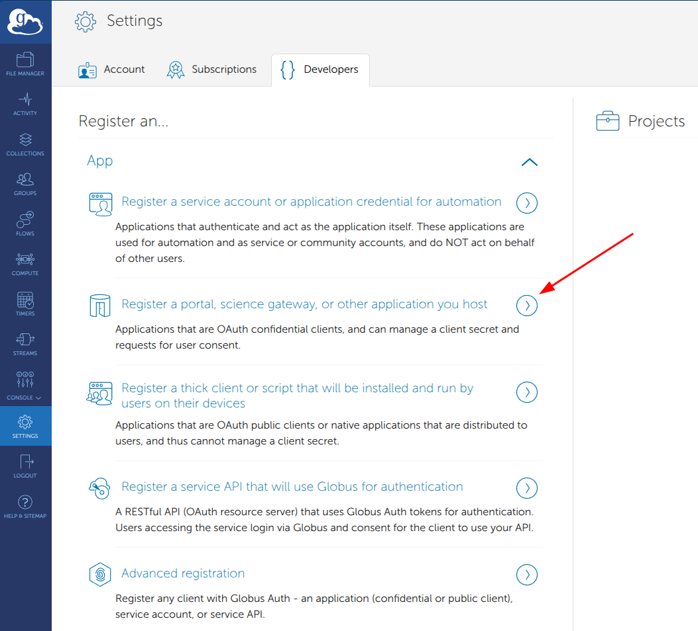
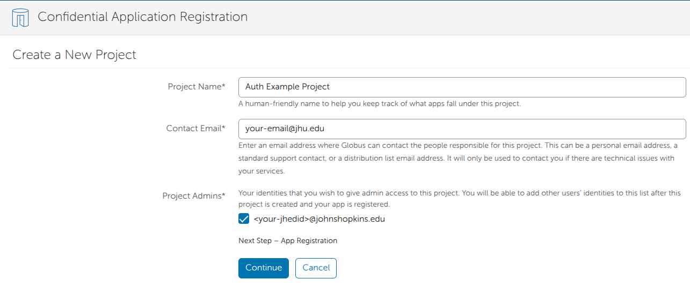
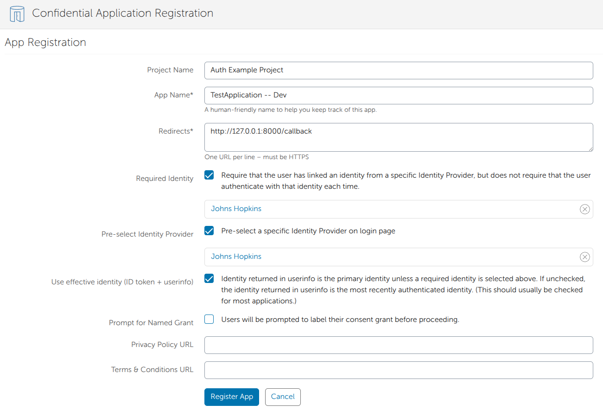
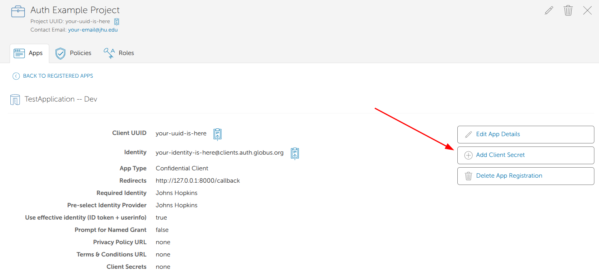
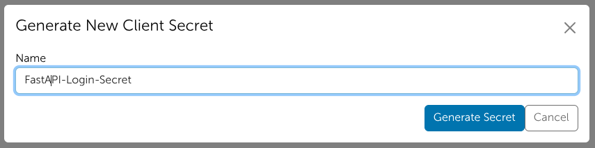
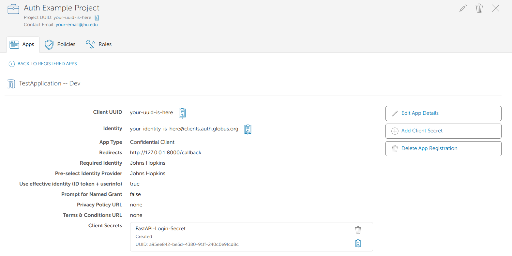
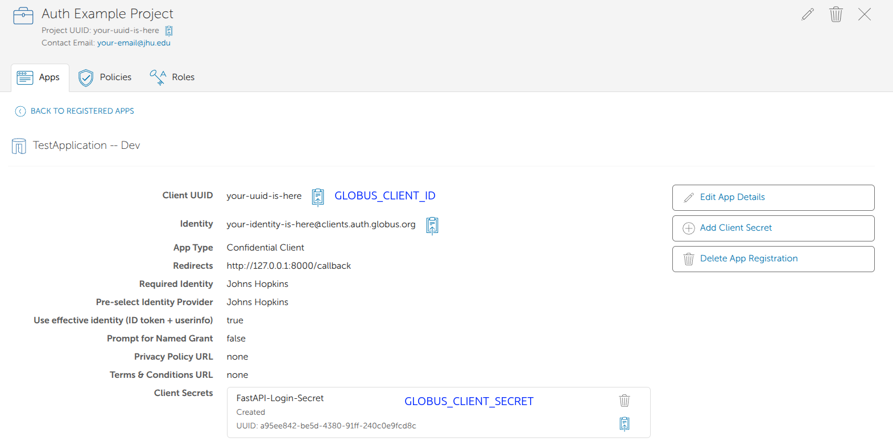
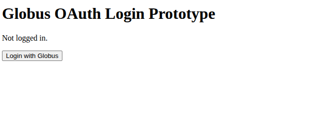
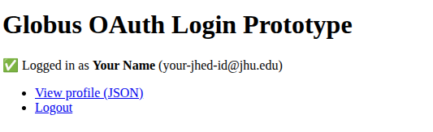

# globus_auth_example

A simple FastAPI prototype that demonstrates OAuth 2.0 login via [Globus Auth](https://docs.globus.org/api/auth/).

## How it works

The app implements the [OAuth 2.0 Authorization Code flow](https://docs.globus.org/api/auth/developer-guide/#obtaining-authorization):

1. **`GET /`** – Home page. Shows login status.
2. **`GET /login`** – Redirects the browser to the Globus Auth authorization endpoint with a random `state` token (CSRF protection).
3. **`GET /callback`** – Handles the redirect from Globus Auth. Validates the `state`, exchanges the authorization code for tokens via the Globus SDK, decodes the OIDC ID token for user identity claims, and stores everything in a signed session cookie.
4. **`GET /profile`** – Protected route. Returns user identity and resource-server token metadata as JSON.
5. **`GET /logout`** – Revokes the Globus access tokens and clears the session.

## Step 1: Register a Globus App

Sign into [app.globus.org](app.globus.org) (You can sign in using Hopkins!)



The goto `Settings -> Developers` and select "Register a portal, science gateway
or other application you host"



If you have an existing Globus project you want to associate it with, select
that. Otherwise, select `None of the above - Create a new project`. If you have
do not have any existing projects you will be prompted to create one:



A globus project can host multiple applications. Fill out the next screen.

The most important part of this screen is the "Redirects" field.

> [!NOTE]
> It says that redirect MUST be HTTPS. I have found that sometimes it will try to
> reject an HTTP version of localhost or 127.0.0.1:8000. If that is the case,
> what has worked for me is to add it as `https` leave the field and then go back
> and remove the `s` in `https`.

When you are done filling out the form click "Register Application"




Now you should be at the details screen for your application. In order to
implement the authorization flow you need to create a secret for your app.
Click "Add Client Secret"



Enter a name for your secret and click "Generate Secret"



After clicking "Generate Secret" you will be presented with a screen showing
you the secret. Copy this secret and save it in a secure location. You will not
be able to see it again. No need to panic if you missed it. You can always
regenerate a new secret.

We now have everything we need to implement the authorization flow.



## Step 2: Configure the repo with your Globus App credentials

Setup the development environment variables

```bash
cp .env.dev .env
```

This has three variables we need to edit:

```bash
GLOBUS_CLIENT_ID=<client-id>
GLOBUS_CLIENT_SECRET=<client-secret>
SESSION_SECRET_KEY=change-me-to-a-long-random-secret
```

The `SESSION_SECRET_KEY` can be generated with the following command:

```bash
python -c "import secrets; print(secrets.token_hex(32))"
```

The other two variables you get from your registered app:



> [!IMPORTANT]
> The `GLOBUS_CLIENT_ID` is the value you copied and carefully kept track of
> when you created the secret!


## Step 3: Run the app!

```bash
uv sync
uv run uvicorn main:app --reload
```

Open <http://127.0.0.1:8000> in your browser and click **Login with Globus**.



If you filled out the app form like the example, "Johns Hopkins" will be filled
in already, if not you will need to fill in the form.

Finish the loging and you should return back to our app page!



